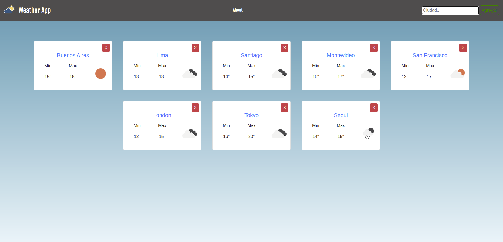
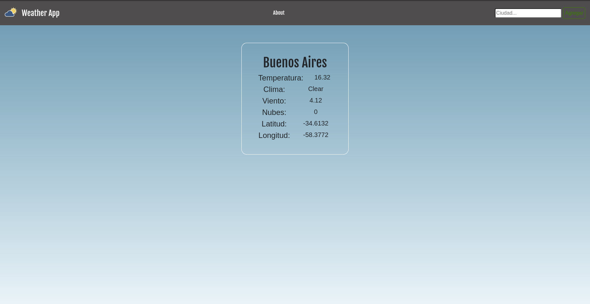

### Hi there, my name is Joaquín 👋
- 😎 I’m currently learning React Native and Typescript
-  🌱 Also I graduated from Henry bootcamp! There, I've learned this technologies and made two individual projects and a grupal project called e-connomy

  
  
  

  
  
  
  
  
  
  
  
  
  
  
  
  
  
  

- 🧙‍♂️ I'm a Front-end lover, I like to work technologies like Javascript, React and Redux 

- 🤠 I really enjoy to learn new things, and know that I can learn a lot of different stuff all the time keeps me motivated 

- 🔜 I also want to learn new technologies such as React-Native and TypeScript📱

- 👨‍💻  You can see my Portfolio <a href="https://joaquinbian.github.io/Portfolio/">here!</a>  

  <h1 align="center">My github stats</h1>
  
  
  

<h1 align="center">My projects!</h1>
  <h3> 📌 Countries-Mate</h3>
  
With this App, you can you can organice your trip and search information about most of the countries in the world! Furthermore you can sort them by population and alphabetically. Also you can filter the countries by their continent and you can add activities that you want to do in a specific country and filter them by activity. 

   
🚀 Technologies implemented: React, Redux, CSS-Modules, Node-Express, Sequelize, PostgreSQL 
   
  

  
    
  
  
  
  
  
  
  
  
  
  

  

  <h3> 📌 Weather-App </h3>
  
With this application you can search how is the weather of any city you want to go to. Also you can find a little bit of more data if you only click on the name of the city!

  
You can see my application <a href="https://joaquinbian.github.io/weatherApp/#/">here</a>, i hope you like it! 

   
  🚀 Technologies implemented: React, & CSS-Modules
   
   

  
    
  
  
  
  

<h3> 📌 Movies-App </h3>

In this Mobile Application you can see the movies that:

<ul>
  <li>are on the billboard 🎦</li>
  <li>the most popular 🔝</li>
  <li>the top rated movies ⭐</li>
  <li>upcoming movies 🔜</li>
</ul>

And also if you are curious and want to know more about a movie, there is a screen that show more information such as:

<ul>
  <li>rating /10 ⭐ </li>
  <li>release date 📆</li>
  <li>review</li>
  <li>genres</li>
  <li>cast 🌠</li>
</ul>

This app was made with React Native CLI (no expo) and Typescript. I used themovieDB API, it also has a gradient that changes the background color depends on wich is the principal movie selected. In the future i am going to add more features. Here are some images:

 

<h3>📌 Pokedex</h3>

 App made with React Native, some of the features are: 

<ul>
  <li>See a list of all pokemons in home screen 🔝</li>
  <li>Filter pokemons by name in search screen 🔎</li>
  <li>See details of each pokemons like habilities, stats, moves, etc 🎮</li>
</ul>

This app was made with React Native CLI (no expo) and Typescript. I used pokeapi API to fetch data and react-native-image-colors, a package that fetch prominent colors form an image to set the background of each pokemon. Here are some videos:

  

<h1 align="center">Contact</h1>
<h3>If you want to know more about me please let me know by contacting me on:</h3>

 📫 e-mail: joacobian21gmail.com
  

   <a href="https://www.linkedin.com/in/joaquin-bianchi-js/">Joaquin Bianchi</a>
  

<!--
**joaquinbian/joaquinbian** is a ✨ _special_ ✨ repository because its `README.md` (this file) appears on your GitHub profile.

Here are some ideas to get you started:

- 🔭 I’m currently working on ...
- 🌱 I’m currently learning ...
- 👯 I’m looking to collaborate on ...
- 🤔 I’m looking for help with ...
- 💬 Ask me about ...
- 📫 How to reach me: ...
- 😄 Pronouns: ...
- ⚡ Fun fact: ...
-->
